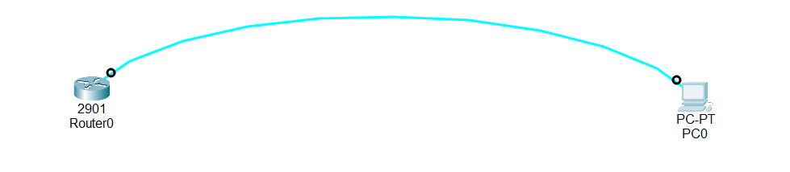

Configure Hostname and Passwords on a Cisco Router

#Lab Overview

In this lab, we perform the basic configuration of a Cisco router.
The main purpose of this lab is to identify the router clearly and secure it from unauthorized access.

##1.Basic Configuration

When we start configuring a Cisco router, we always begin with basic settings.
This is a good practice for all network engineers.

##2.Basic configuration includes:

Giving the device a clear name (hostname)

Setting passwords to protect the router from unauthorized access

These steps make the network secure and easy to understand.

##3.Hostname Configuration

By default:

A Cisco router is named “router”

A Cisco switch is named “switch”

These default names are not helpful in real networks.
Changing the hostname helps us identify the device easily, especially when many devices are used.

Good hostname examples:

Based on location: NewYork-1700

Based on role: ISP-Router

When the hostname is changed, the new name appears immediately on the screen.
This helps us know which device we are configuring.

##4.Privileged Mode Passwords

The router has a Privileged EXEC mode, which allows full control of the device.

There are two types of passwords:

Enable Password (less secure)

Enable Secret (more secure)

If both are set:

The router will always ask for the enable secret

Enable secret is considered stronger and safer

Every time a user wants to enter privileged mode, a password is required.

##5.Console Line Password

The console password protects local access to the router.

This means:

Anyone connecting with a console cable must enter a password

This prevents unauthorized people from accessing the router

Console security is very important, especially when the router is in a public or shared place.

##6.Auxiliary (AUX) Line Password

The AUX line is used for remote access using a modem.

It also uses a password to:

Protect the router from unauthorized remote access

##7 Topology & Download
Here is the network topology for this lab:

<!-- Download button below the image -->
<a href="Configure name and passwords on router.pkt" download style="display: inline-block; padding: 10px 20px; background-color: #4CAF50; color: white; text-decoration: none; border-radius: 5px;">
Download Lab1 Packet Tracer File
</a>

##8Lab Tasks

1.Setting router name to R1
2.Set privileged mode password to ali
3.Set privileged mode secret to ali1
4.Set console line password to lab 
5.Set auxiliary line password to alilab

Lab Configuration

Task1
Setting router name to R1

Router(config)#hostname R1
R1(config)#

Task2
Set privileged mode password to ali

R1(config)#enable password ali
R1(config)#

Task3
Set privileged mode secret to ali1

R1(config)#enable secret ali1
R1(config)#

Task4
Set console line password to lab

R1(config)#line console 0
R1(config-line)#
R1(config-line)#password lab
R1(config-line)#
R1(config-line)#login

Task5
Set auxiliary line password to alilab

R1(config)#line AUX 0
R1(config-line)#
R1(config-line)#password alilab
R1(config-line)#
R1(config-line)#login