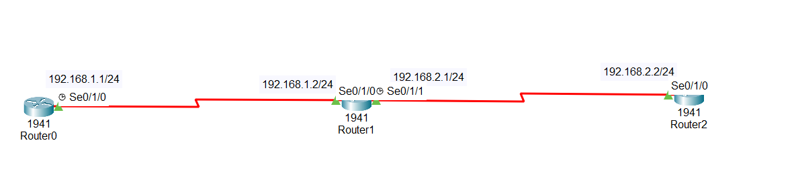

#Basic Router Configuration Using RIP (Packet Tracer Lab)

##1.Lab Overview

In this lab, we configure three Cisco routers in Cisco Packet Tracer and enable dynamic routing using the RIP (Routing Information Protocol).
The main objective is to allow all routers to automatically learn routes to all networks without using static routes.

This lab focuses on:

Basic router configuration

Interface IP addressing

and configuring RIP

Verifying learned routes

Basic troubleshooting

Best practices (hostnames, interface descriptions, banners)

##2.About RIP (Routing Information Protocol)

RIP is a distance-vector routing protocol that uses hop count as its metric to determine the best path to a destination network.

##3.Key Characteristics of RIP

##Uses hop count as the routing metric

Maximum hop count: 15

Simple to configure

Periodically sends routing updates

Suitable for small networks

##4.Why Use RIP?

RIP is still used because of its simplicity.
It is ideal for:

Small company networks

Lab environments

Networks with a small number of routers

Large enterprise networks usually prefer advanced routing protocols like OSPF or EIGRP, which offer better scalability, faster convergence, and more advanced features.

##5.Lab Objectives

By completing this lab, you will be able to:

Assign IP addresses to router interfaces

Configure router hostnames

Add descriptions to interfaces

Enable RIP routing protocol

Disable RIP auto-summarization

Verify routing tables

Configure MOTD banners

Troubleshoot routing issues

##6.Interface IP Addressing

To allow communication between routers:

Each router interface is assigned an IP address

Interfaces are brought up using the no shutdown command

Without proper IP addressing, routing protocols cannot exchange routes.

##7.Enabling RIP Routing Protocol

To enable routing between routers, we use RIP.

RIP dynamically:

Advertises connected networks

Learns remote networks

Updates the routing table automatically

RIP configuration is simple compared to link-state protocols, making it ideal for beginners and small networks.

##8.Disabling Auto-Summarization

By default, RIP auto-summarizes routes at classful boundaries.
This can cause routing issues, especially in modern networks using VLSM or discontiguous networks.

To prevent this:

Auto-summarization is disabled on each router

This ensures:

Accurate routing information

Correct subnet advertisement

Reliable routing behavior

##9.Verifying Routing Table

After configuring RIP, we verify that routes are learned correctly.

We use the command:

 .show ip route

In the routing table:

Routes learned via RIP are marked with R

Each router should learn all networks in the topology

If routes are missing, configuration must be checked.

##10.Troubleshooting

If routes are not learned:

Check IP addressing

Verify RIP network statements

Ensure interfaces are up

Confirm no auto-summary is configured

Check routing table on each router

Troubleshooting is a key skill in real-world networking.

##11.Banner Configuration

A Message of the Day (MOTD) banner is configured on all routers.

Purpose of MOTD banner:

Displays a warning or information message

Used for security and legal notification

Prevents unauthorized access

##12 Topology & Download
Here is the network topology for this lab:

<!-- Download button below the image -->
<a href="https://raw.githubusercontent.com/abakar61/network_security_labs/main/Lab-02-RIP_%20configurations_in_packet_tracer/Lab2_RIP_Configuation.pkt" download style="display: inline-block; padding: 10px 20px; background-color: #4CAF50; color: white; text-decoration: none; border-radius: 5px;">
Download Lab 2 Packet Tracer File
</a>

##13.Lab Tasks

1.assign IP address the router interfaces
2.enable rip protocol and disable auto summarization
3.set router 0 name as Arizona, router 1 as Virginia, router 2 as NY
4.Set description of the interfaces as follow
5.configure banner motd in all routers

##14Lab Configuration

Task 1
assign IP address the router interfaces

Router0
Arizona(config)#int se0/1/0
Arizona(config-if)#
Arizona(config-if)#ip add 192.168.1.1 255.255.255.0
Arizona(config-if)#
Arizona(config-if)#no shut

Router1
Virginia(config)#int se0/1/0
Virginia(config-if)#
Virginia(config-if)#ip add 192.168.1.2 255.255.255.0
Virginia(config-if)#
Virginia(config-if)#no shut

Router1
Virginia(config)#int se0/1/1
Virginia(config-if)#
Virginia(config-if)#ip add 192.168.2.1 255.255.255.0
Virginia(config-if)#
Virginia(config-if)#no shut

Router2
NY(config)#int se0/1/0
NY(config-if)#
NY(config-if)#ip add 192.168.2.2 255.255.255.0
NY(config-if)#
NY(config-if)#no shut

Task 2
enable rip protocol and disable auto summarization

Router0
Arizona(config)#router rip
Arizona(config-router)#
Arizona(config-router)#ver 2
Arizona(config-router)#
Arizona(config-router)#network 192.168.1.0
Arizona(config-router)#
Arizona(config-router)#no auto-summary

Router1
Virginia(config)#router rip
Virginia(config-router)#
Virginia(config-router)#ver 2
Virginia(config-router)#
Virginia(config-router)#network 192.168.1.0
Virginia(config-router)#network 192.168.2.0
Virginia(config-router)#
Virginia(config-router)#no auto-summary

router2
NY(config)#router rip
NY(config-router)#
NY(config-router)#ver 2
NY(config-router)#
NY(config-router)#network 192.168.2.0
NY(config-router)#
NY(config-router)#no auto-summary

Task3
set router 0 name as Arizona, router 1 as Virginia, router 2 as NY

as you can see each router has the name require here.

to change the router name just:

hostname router-name

Task4
Set description of the interfaces as follow

router0
Arizona(config)#int se0/1/0
Arizona(config-if)#
Arizona(config-if)#description connection to the headquarter

router1
Virginia(config)#int se0/1/0
Virginia(config-if)#
Virginia(config-if)#description connection to the branch 1

router1
Virginia(config)#int se0/1/1
Virginia(config-if)#
Virginia(config-if)#description connection to the branch 2

router2
NY(config)#int se0/1/0
NY(config-if)#
NY(config-if)#)#description connection to the headquarter

Task5
On all routers

Router(config)#banner motd / —- UNAUTHORIZED ACCESS IS NOT ALLOWED —- /

